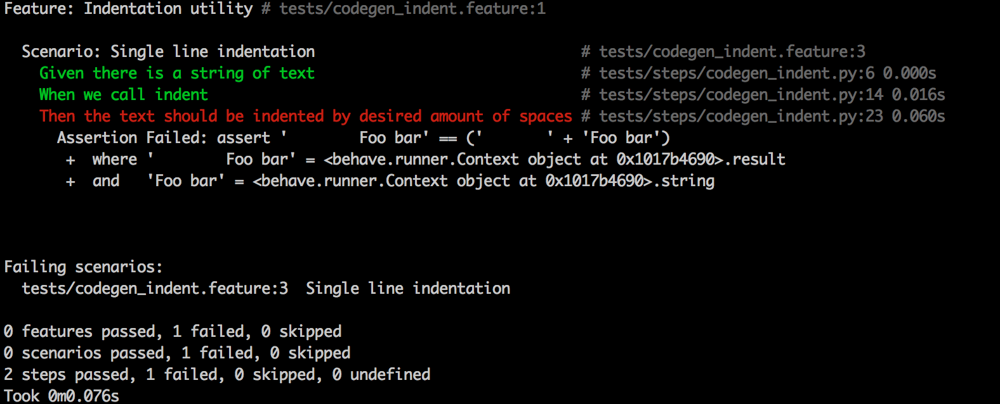

behave-pytest (reborn)
=============================================================================

:FORKED-FROM: https://github.com/ribozz/behave-pytest.git
:State: Currently broken, works no longer w/ current pytest version.

Small utility package to integrate `pytest`_ asserts into `behave`_ project.

.. _pytest: https://docs.pytest.org/
.. _behave: https://github.com/behave/behave

Installation:

.. code-block:: sh

    # XXX-WORKMARK-TODO:
    $ pip install behave-pytest

Add before_all hook into your project. like this (features/environment.py):

.. code-block:: python

    # -- FILE: features/environment.py
    from behave_pytest.hook import install_pytest_asserts

    def before_all(context):
        install_pytest_asserts()

That's it.  
When running test you will see standard pytest assertion details:

